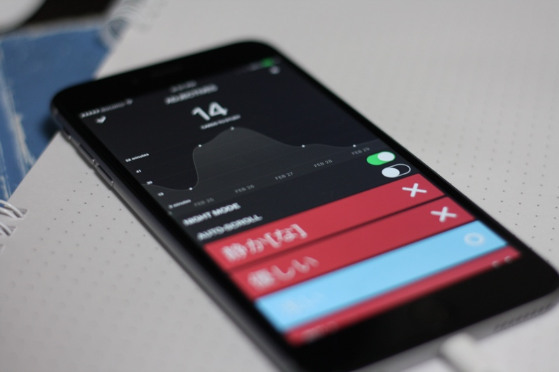
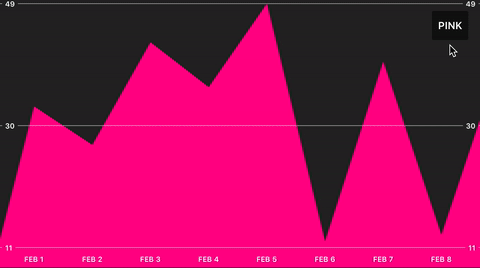
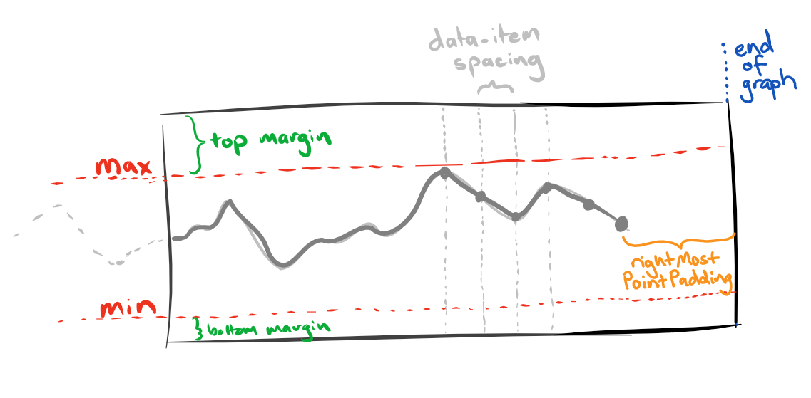
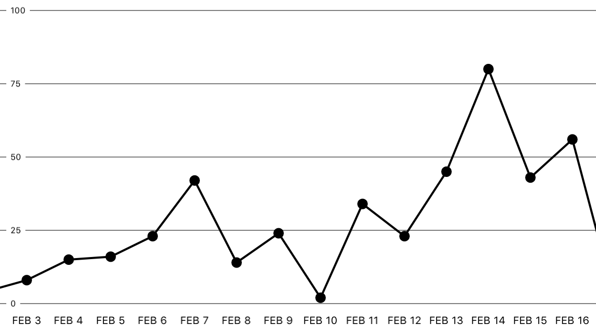
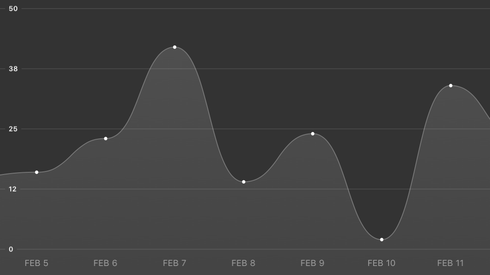
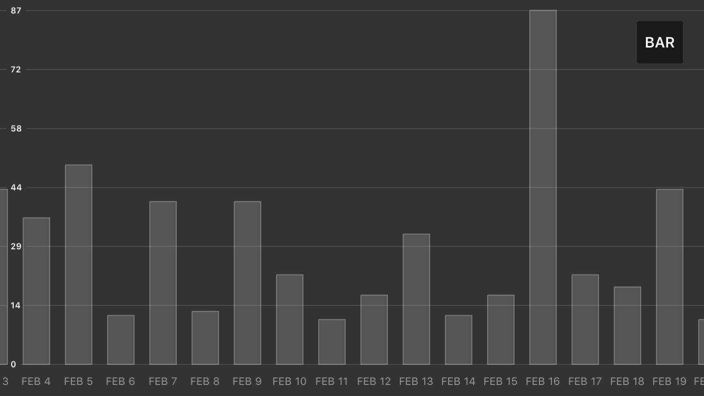
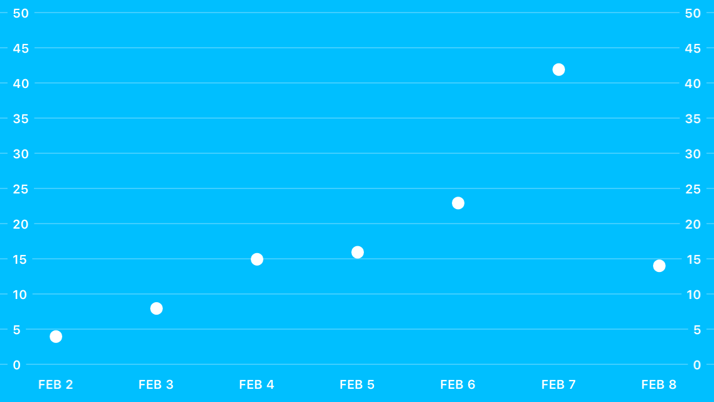
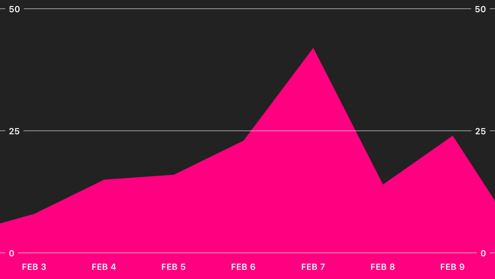
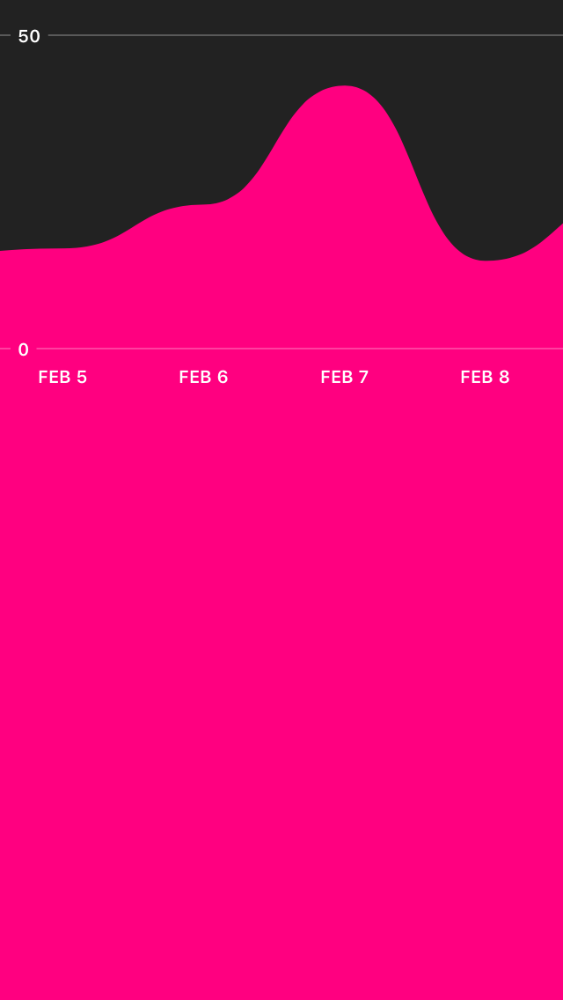

# ScrollableGraphView

# Announcement

A new version (4) will be coming soon which adds multiple plots, dynamic reloading of data, more reference line customisation options and various bug fixes.

The public interface will be incompatible with previous versions. You can always use specify to use version 3 in CocoaPods if you prefer to keep using the older version.

## About



An adaptive scrollable graph view for iOS to visualise simple discrete datasets. Written in Swift. Originally written for a small personal project.

The main goal of the this graph component is to visualise simple discrete datasets and allow the the user to scroll through the graph.


### Contribution

All pull requests are welcome. There is a list of features people would like on the issues page, ranging from simple changes to quite complex. Feel free to jump on in.

## Contents

- [Features](#features)
- [Basic Usage](#usage)
- [Customisation](#customisation)
- [Customisation Examples](#customisation-examples)
- [Improvements](#improvements)
- [Known Issues](#known-issues)
- [Other](#other)

## Features

| Feature List |
|--------|
| Initialisation animations and range adaption animations. <br><br> |
| Range adaption when scrolling through the graph. The range of the y-axis will automatically adapt to to the min and max of the visible points. <br><br> |
| Smooth scrolling around the graph. <br><br> |
| Handles a relatively large number of points without lagging. <br><br> |
| Many customisation options. (Check the customisation section) <br><br> |


## Usage

### Adding the ScrollableGraphView to your project:

Add the ```ScrollableGraphView``` class to your project. There are two ways to add the ScrollableGraphView to your project.

#### Manually
Add [ScrollableGraphView.swift](Classes/ScrollableGraphView.swift) to your project in Xcode  

#### CocoaPods
Add ```pod 'ScrollableGraphView'``` to your Podfile and then make sure to ```import ScrollableGraphView``` in your code.

### Creating a graph and setting the data.

1. Create a ScrollableGraphView instance and set the data and labels  
    ```swift
    let graphView = ScrollableGraphView(frame: someFrame)
    let data: [Double] = [4, 8, 15, 16, 23, 42]
    let labels = ["one", "two", "three", "four", "five", "six"]
    graphView.setData(data, withLabels: labels)
    ```  

2. Add the ScrollableGraphView to the view hierarchy.
    ```swift
    someViewController.view.addSubview(graphView)
    ```

### Interface Builder support

There is now support for Interface Builder (from CocoaPod version 2.0.0). See the example project in the folder: `graphview_example_ib`

### Things you *could* use it for:

- ✔ Study applications to show time studied/etc
- ✔ Weather applications
- ✔ Prototyping
- ✔ *Simple* data visualisation

### Things you **shouldn't/cannot** use it for:

- ✘ Rigorous statistical software
- ✘ Important & complex data visualisation
- ✘ Graphing continuous mathematical functions

## Customisation

The graph can be customised by setting any of the following public properties before displaying the ScrollableGraphView. The defaults are shown below.

### Line Styles

| Property  | Description                                                                                                                                                                        |
|-----------|------------------------------------------------------------------------------------------------------------------------------------------------------------------------------------|
| **lineWidth**: CGFloat | Specifies how thick the graph of the line is. In points.                                                                                                                           |
| **lineColor**: UIColor | The color of the graph line. UIColor.                                                                                                                                              |
| **lineStyle**: ScrollableGraphViewLineStyle | Whether or not the line should be rendered using bezier curves are straight lines. Possible values: <ul><li>`ScrollableGraphViewLineStyle.Straight`</li><li>`ScrollableGraphViewLineStyle.Smooth`</li></ul> |
| **lineJoin**  | How each segment in the line should connect. Takes any of the Core Animation LineJoin values.                                                                                      |
| **lineCap**   | The line caps. Takes any of the Core Animation LineCap values.                                                                                                                     |

### Fill Styles
| Property               | Description                                                                                                                                                                                                         |
|------------------------|---------------------------------------------------------------------------------------------------------------------------------------------------------------------------------------------------------------------|
| **backgroundFillColor**: UIColor    | The background colour for the entire graph view, not just the plotted graph.                                                                                                                                        |
| **shouldFill**: Bool             | Specifies whether or not the plotted graph should be filled with a colour or gradient.                                                                                                                              |
| **fillType**: ScrollableGraphViewFillType               | Specifies whether to fill the graph with a solid colour or gradient. Possible values: <ul><li>`ScrollableGraphViewFillType.Solid`</li> <li>`ScrollableGraphViewFillType.Gradient`</li></ul>                                                         |
| **fillColor**: UIColor              | If `fillType` is set to `.Solid` then this colour will be used to fill the graph.                                                                                                                                       |
| **fillGradientStartColor**: UIColor | If `fillType` is set to `.Gradient` then this will be the starting colour for the gradient.                                                                                                                             |
| **fillGradientEndColor**: UIColor   | If `fillType` is set to `.Gradient`, then this will be the ending colour for the gradient.                                                                                                                              |
| **fillGradientType**:ScrollableGraphViewGradientType       | If `fillType` is set to `.Gradient`, then this defines whether the gradient is rendered as a linear gradient or radial gradient. Possible values: <ul><li>`ScrollableGraphViewFillType.Solid`</li><li>`ScrollableGraphViewFillType.Gradient`</li></ul> |

### Bar Styles

| Property                 | Description                                                                                                                                                                                                                                                           |
|--------------------------|-----------------------------------------------------------------------------------------------------------------------------------------------------------------------------------------------------------------------------------------------------------------------|
| **shouldDrawBarLayer**: Bool | Whether bars should be drawn or not. If you want a bar graph, this should be set to `true`. However, you will probably want to disable drawing the data points with `shouldDrawDataPoint = false`. If you want to hide the line as well: `lineColor = UIColor.clearColor()` |
| **barWidth**: CGFloat        | The width of an individual bar on the graph.                                                                                                                                                                                                                          |
| **barColor**: UIColor        | The actual colour of the bar.                                                                                                                                                                                                                                         |
| **barLineWidth**: CGFloat    | The width of the outline of the bar                                                                                                                                                                                                                                   |
| **barLineColor**: UIColor    | The colour of the bar outline                                                                                                                                                                                                                                         |
| **shouldRoundBarCorners**: Bool    | Whether or not to use rounded corners for the bars.                                                                                                                                                                                                                                        |

### Spacing



| Property              | Description                                                                                                                                                                                                                                                                                                |
|-----------------------|------------------------------------------------------------------------------------------------------------------------------------------------------------------------------------------------------------------------------------------------------------------------------------------------------------|
| **topMargin**: CGFloat             | How far the "maximum" reference line is from the top of the view's frame. In points.                                                                                                                                                                                                                       |
| **bottomMargin**: CGFloat          | How far the "minimum" reference line is from the bottom of the view's frame. In points.                                                                                                                                                                                                                    |
| **leftmostPointPadding**: CGFloat  | How far the first point on the graph should be placed from the left hand side of the view.                                                                                                                                                                                                                 |
| **rightmostPointPadding**: CGFloat | How far the final point on the graph should be placed from the right hand side of the view.                                                                                                                                                                                                                |
| **dataPointSpacing**: CGFloat      | How much space should be between each data point.                                                                                                                                                                                                                                                          |
| **direction**: ScrollableGraphViewDirection             | Which way the user is expected to scroll from. Possible values: <ul><li>`ScrollableGraphViewDirection.LeftToRight`</li><li>`ScrollableGraphViewDirection.RightToLeft`</li></ul>For example, if it is set to `.RightToLeft`, the graph will start on the "right hand side" of the graph and the user will have to scroll towards the left. |


### Graph Range

| Property                       | Description                                                                                                                                                                                                |
|--------------------------------|------------------------------------------------------------------------------------------------------------------------------------------------------------------------------------------------------------|
| **rangeMin**: Double                       | The minimum value for the y-axis. This is ignored when `shouldAutomaticallyDetectRange` or `shouldAdaptRange` = `true`                                                                                           |
| **rangeMax**: Double                       | The maximum value for the y-axis. This is ignored when `shouldAutomaticallyDetectRange` or `shouldAdaptRange` = `true`                                                                                           |
| **shouldAutomaticallyDetectRange**: Bool | If this is set to `true`, then the range will automatically be detected from the data the graph is given.                                                                                                    |
| **shouldRangeAlwaysStartAtZero**: Bool   | Forces the graph's minimum to always be zero. Used in conjunction with `shouldAutomaticallyDetectRange` or `shouldAdaptRange`, if you want to force the minimum to stay at 0 rather than the detected minimum. |


### Data Point Drawing

| Property                                                  | Description                                                                                                                                                                                                                                                                 |
|-----------------------------------------------------------|-----------------------------------------------------------------------------------------------------------------------------------------------------------------------------------------------------------------------------------------------------------------------------|
| **shouldDrawDataPoint**: Bool                                 | Whether or not to draw a symbol for each data point.                                                                                                                                                                                                                        |
| **dataPointType**: ScrollableGraphViewDataPointType           | The shape to draw for each data point. Possible values: <ul><li>`ScrollableGraphViewDataPointType.Circle`</li><li>`ScrollableGraphViewDataPointType.Square`</li><li>`ScrollableGraphViewDataPointType.Custom`</li></ul>                                                                                               |
| **dataPointSize**: CGFloat                                    | The size of the shape to draw for each data point.                                                                                                                                                                                                                          |
| **dataPointFillColor**: UIColor                               | The colour with which to fill the shape.                                                                                                                                                                                                                                    |
| **customDataPointPath**: ((centre: CGPoint) -> UIBezierPath)? | If `dataPointType` is set to `.Custom` then you,can provide a closure to create any kind of shape you would like to be displayed instead of just a circle or square. The closure takes a `CGPoint` which is the centre of the shape and it should return a complete `UIBezierPath`. |

### Adapting & Animations

| Property                                                | Description                                                                                                                                                                                                                                                                                            |
|---------------------------------------------------------|--------------------------------------------------------------------------------------------------------------------------------------------------------------------------------------------------------------------------------------------------------------------------------------------------------|
| **shouldAdaptRange**: Bool                                  | Whether or not the y-axis' range should adapt to the points that are visible on screen. This means if there are only 5 points visible on screen at any given time, the maximum on the y-axis will be the maximum of those 5 points. This is updated automatically as the user scrolls along the graph. |
| **shouldAnimateOnAdapt**: Bool                              | If `shouldAdaptRange` is set to true then this specifies whether or not the points on the graph should animate to their new positions. Default is set to `true`. Looks very janky if set to `false`.                                                                                                         |
| **animationDuration**: Double                               | How long the animation should take. Affects both the startup animation and the animation when the range of the y-axis adapts to onscreen points.                                                                                                                                                       |
| **adaptAnimationType**: ScrollableGraphViewAnimationType    | The animation style. Possible values: <ul><li>`ScrollableGraphViewAnimationType.EaseOut`</li><li>`ScrollableGraphViewAnimationType.Elastic`</li><li>`ScrollableGraphViewAnimationType.Custom`</li></ul>                                                                                                                                          |
| **customAnimationEasingFunction**: ((t: Double) -> Double)? | If `adaptAnimationType` is set to `.Custom`, then this is the easing function you would like applied for the animation.                                                                                                                                                                                    |
| **shouldAnimateOnStartup**: Bool                            | Whether or not the graph should animate to their positions when the graph is first displayed.                                                                                                                                                                                                          |

### Reference Lines

| Property                                                        | Description                                                                                                                                                                                                                                                                                                                                                                                                                                                                  |
|-----------------------------------------------------------------|------------------------------------------------------------------------------------------------------------------------------------------------------------------------------------------------------------------------------------------------------------------------------------------------------------------------------------------------------------------------------------------------------------------------------------------------------------------------------|
| **shouldShowReferenceLines**: Bool                                  | Whether or not to show the y-axis reference lines and labels.                                                                                                                                                                                                                                                                                                                                                                                                                |
| **referenceLineColor**: UIColor                                     | The colour for the reference lines.                                                                                                                                                                                                                                                                                                                                                                                                                                          |
| **referenceLineThickness**: CGFloat                                 | The thickness of the reference lines.                                                                                                                                                                                                                                                                                                                                                                                                                                        |
| **referenceLinePosition**: ScrollableGraphViewReferenceLinePosition | Where the labels should be displayed on the reference lines. Possible values: <ul><li>`ScrollableGraphViewReferenceLinePosition.Left`</li><li>`ScrollableGraphViewReferenceLinePosition.Right`</li><li>`ScrollableGraphViewReferenceLinePosition.Both`</li></ul>                                                                                                                                                                                                                                                       |
| **referenceLineType**: ScrollableGraphViewReferenceLineType         | The type of reference lines. Currently only `.Cover` is available.                                                                                                                                                                                                                                                                                                                                                                                                             |
| **numberOfIntermediateReferenceLines**: Int                         | How many reference lines should be between the minimum and maximum reference lines. If you want a total of 4 reference lines, you would set this to 2. This can be set to 0 for no intermediate reference lines.This can be used to create reference lines at specific intervals. If the desired result is to have a reference line at every 10 units on the y-axis, you could, for example, set `rangeMax` to 100, rangeMin to 0 and `numberOfIntermediateReferenceLines` to 9. |
| **shouldAddLabelsToIntermediateReferenceLines**: Bool               | Whether or not to add labels to the intermediate reference lines.                                                                                                                                                                                                                                                                                                                                                                                                            |
| **shouldAddUnitsToIntermediateReferenceLineLabels**: Bool           | Whether or not to add units specified by the `referenceLineUnits` variable to the labels on the intermediate reference lines.                                                                                                                                                                                                                                                                                                                                                  |

### Reference Line Labels

| Property                                | Description                                                                             |
|-----------------------------------------|-----------------------------------------------------------------------------------------|
| **referenceLineLabelFont**: UIFont          | The font to be used for the reference line labels.                                      |
| **referenceLineLabelColor**: UIColor        | The colour of the reference line labels.                                                |
| **shouldShowReferenceLineUnits**: Bool      | Whether or not to show the units on the reference lines.                                |
| **referenceLineUnits**: String?             | The units that the y-axis is in. This string is used for labels on the reference lines. |
| **referenceLineNumberOfDecimalPlaces**: Int | The number of decimal places that should be shown on the reference line labels.         |
| **referenceLineNumberStyle**: NSNumberFormatterStyle | The number style that should be shown on the reference line labels.         |

### Data Point Labels (x-axis)

| Property                            | Description                                                                         |
|-------------------------------------|-------------------------------------------------------------------------------------|
| **shouldShowLabels**: Bool              | Whether or not to show the labels on the x-axis for each point.                     |
| **dataPointLabelTopMargin**: CGFloat    | How far from the "minimum" reference line the data point labels should be rendered. |
| **dataPointLabelBottomMargin**: CGFloat | How far from the bottom of the view the data point labels should be rendered.       |
| **dataPointLabelFont**: UIFont?         | The font for the data point labels.                                                 |
| **dataPointLabelColor**: UIColor        | The colour for the data point labels.                                               |
| **dataPointLabelsSparsity**: Int        | Used to force the graph to show every n-th dataPoint label                          |

## Customisation Examples

_Note: Examples here use a "colorFromHex" extension for UIColor._

### Default

```swift
let graphView = ScrollableGraphView(frame: frame)
graphView.setData(data, withLabels: labels)
self.view.addSubview(graphView)
```

### Smooth Dark

```swift
let graphView = ScrollableGraphView(frame: frame)

graphView.backgroundFillColor = UIColor.colorFromHex("#333333")

graphView.rangeMax = 50

graphView.lineWidth = 1
graphView.lineColor = UIColor.colorFromHex("#777777")
graphView.lineStyle = ScrollableGraphViewLineStyle.Smooth

graphView.shouldFill = true
graphView.fillType = ScrollableGraphViewFillType.Gradient
graphView.fillColor = UIColor.colorFromHex("#555555")
graphView.fillGradientType = ScrollableGraphViewGradientType.Linear
graphView.fillGradientStartColor = UIColor.colorFromHex("#555555")
graphView.fillGradientEndColor = UIColor.colorFromHex("#444444")

graphView.dataPointSpacing = 80
graphView.dataPointSize = 2
graphView.dataPointFillColor = UIColor.whiteColor()

graphView.referenceLineLabelFont = UIFont.boldSystemFontOfSize(8)
graphView.referenceLineColor = UIColor.whiteColor().colorWithAlphaComponent(0.2)
graphView.referenceLineLabelColor = UIColor.whiteColor()
graphView.dataPointLabelColor = UIColor.whiteColor().colorWithAlphaComponent(0.5)

graphView.setData(data, withLabels: labels)
self.view.addSubview(graphView)
```

### Bar Dark (Bar layer thanks to [@RedBlueThing](https://twitter.com/RedBlueThing))

```swift
let graphView = ScrollableGraphView(frame:frame)  

// Disable the lines and data points.
graphView.shouldDrawDataPoint = false
graphView.lineColor = UIColor.clearColor()

// Tell the graph it should draw the bar layer instead.
graphView.shouldDrawBarLayer = true

// Customise the bar.
graphView.barWidth = 25
graphView.barLineWidth = 1
graphView.barLineColor = UIColor.colorFromHex("#777777")
graphView.barColor = UIColor.colorFromHex("#555555")
graphView.backgroundFillColor = UIColor.colorFromHex("#333333")

graphView.referenceLineLabelFont = UIFont.boldSystemFontOfSize(8)
graphView.referenceLineColor = UIColor.whiteColor().colorWithAlphaComponent(0.2)
graphView.referenceLineLabelColor = UIColor.whiteColor()
graphView.numberOfIntermediateReferenceLines = 5
graphView.dataPointLabelColor = UIColor.whiteColor().colorWithAlphaComponent(0.5)

graphView.shouldAnimateOnStartup = true
graphView.shouldAdaptRange = true
graphView.adaptAnimationType = ScrollableGraphViewAnimationType.Elastic
graphView.animationDuration = 1.5
graphView.rangeMax = 50
graphView.shouldRangeAlwaysStartAtZero = true
```

### Dot

```swift
let graphView = ScrollableGraphView(frame:frame)
graphView.backgroundFillColor = UIColor.colorFromHex("#00BFFF")
graphView.lineColor = UIColor.clearColor()

graphView.dataPointSize = 5
graphView.dataPointSpacing = 80
graphView.dataPointLabelFont = UIFont.boldSystemFontOfSize(10)
graphView.dataPointLabelColor = UIColor.whiteColor()
graphView.dataPointFillColor = UIColor.whiteColor()

graphView.referenceLineLabelFont = UIFont.boldSystemFontOfSize(10)
graphView.referenceLineColor = UIColor.whiteColor().colorWithAlphaComponent(0.5)
graphView.referenceLineLabelColor = UIColor.whiteColor()
graphView.referenceLinePosition = ScrollableGraphViewReferenceLinePosition.Both

graphView.numberOfIntermediateReferenceLines = 9

graphView.rangeMax = 50

self.view.addSubview(graphView)
```

### Pink Mountain

```swift
let graphView = ScrollableGraphView(frame:frame)
graphView.backgroundFillColor = UIColor.colorFromHex("#222222")
graphView.lineColor = UIColor.clearColor()

graphView.shouldFill = true
graphView.fillColor = UIColor.colorFromHex("#FF0080")

graphView.shouldDrawDataPoint = false
graphView.dataPointSpacing = 80
graphView.dataPointLabelFont = UIFont.boldSystemFontOfSize(10)
graphView.dataPointLabelColor = UIColor.whiteColor()

graphView.referenceLineThickness = 1
graphView.referenceLineLabelFont = UIFont.boldSystemFontOfSize(10)
graphView.referenceLineColor = UIColor.whiteColor().colorWithAlphaComponent(0.5)
graphView.referenceLineLabelColor = UIColor.whiteColor()
graphView.referenceLinePosition = ScrollableGraphViewReferenceLinePosition.Both

graphView.numberOfIntermediateReferenceLines = 1

graphView.rangeMax = 50

self.view.addSubview(graphView)
```

### Solid Pink with Margins
You can use the top and bottom margin to leave space for other content:


```swift
let graphView = ScrollableGraphView(frame:frame)

graphView.bottomMargin = 350
graphView.topMargin = 20

graphView.backgroundFillColor = UIColor.colorFromHex("#222222")
graphView.lineColor = UIColor.clearColor()
graphView.lineStyle = ScrollableGraphViewLineStyle.Smooth

graphView.shouldFill = true
graphView.fillColor = UIColor.colorFromHex("#FF0080")

graphView.shouldDrawDataPoint = false
graphView.dataPointSpacing = 80
graphView.dataPointLabelFont = UIFont.boldSystemFontOfSize(10)
graphView.dataPointLabelColor = UIColor.whiteColor()

graphView.referenceLineThickness = 1
graphView.referenceLineLabelFont = UIFont.boldSystemFontOfSize(10)
graphView.referenceLineColor = UIColor.whiteColor().colorWithAlphaComponent(0.25)
graphView.referenceLineLabelColor = UIColor.whiteColor()

graphView.numberOfIntermediateReferenceLines = 0

graphView.rangeMax = 50

self.view.addSubview(graphView)
```


## Known Issues

- Note: Performance in the simulator is not ideal.

If you find any bugs please create an issue on Github.


## Other

[Follow me on twitter](https://twitter.com/philackm) for interesting updates (read: gifs) about other things that I make.
