# ScrollableGraphView

## Announcements

### 9-7-2017 - Looking for Examples:

If your application uses this component and you would like to show it off, please let me know as I would like to create a gallery. Please create a pull request and update the [examples.md](examples.md) with the app name and URL. I will add screenshots of the applications to a gallery for everyone to see.

### 9-7-2017 - Version 4: 

Version 4 was released which adds multiple plots, dynamic reloading of values, more reference line customisation options and various bug fixes. The public interface will be incompatible with previous versions. If you prefer to keep using the older version, make sure to specify version 3 in your podfile.

## About


An adaptive scrollable graph view for iOS to visualise simple discrete datasets. Written in Swift. Originally written for a small personal project.

The main goal of the this graph component is to visualise simple discrete datasets and allow the the user to scroll through the graph.


### Contribution

All pull requests are welcome. There is a list of features people would like on the issues page, ranging from simple changes to quite complex. Feel free to jump on in.

## Contents

- [Features](#features)
- [Basic Usage](#usage)
- [Customisation](#customisation)
- [Customisation Examples](#customisation-examples)
- [Improvements](#improvements)
- [Known Issues](#known-issues)
- [Other](#other)

## Features

| Feature List |
|--------|
| Initialisation animations and range adaption animations. <br><br> 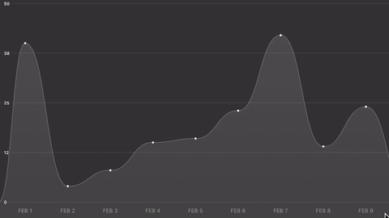|
| Multiple plots and dynamic reloading of the values. <br><br> 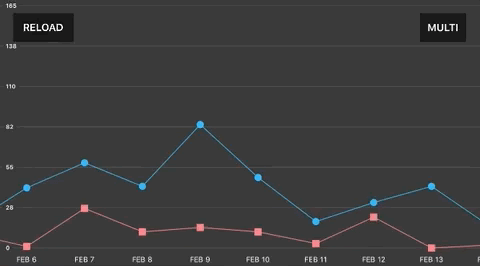|
| Range adaption when scrolling through the graph. The range of the y-axis will automatically adapt to to the min and max of the visible points. <br><br> |
| Smooth scrolling around the graph. <br><br> 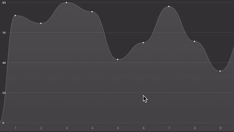|
| Handles as many points as you can throw at it. <br><br> |
| Many customisation options. (Check the customisation section) <br><br> |

## Usage

### Adding the ScrollableGraphView to your project:

Add the ```ScrollableGraphView``` class to your project. There are two ways to add the ScrollableGraphView to your project.

#### Manually
Add all of the files in the [Classes](Classes/) directory to your project in Xcode to your project in Xcode.

#### CocoaPods
Add ```pod 'ScrollableGraphView'``` to your Podfile and then make sure to ```import ScrollableGraphView``` in your code.

#### Carthage
Coming soon.

### Creating a graph and providing it with data.

1. Create a ScrollableGraphView instance. The graph requires a data source, which is an object that conforms to the `ScrollableGraphViewDataSource` protocol.

    ```swift
    // Compose the graph view by creating a graph, then adding any plots
    // and reference lines before adding the graph to the view hierarchy.
    let graphView = ScrollableGraphView(frame: frame, dataSource: self)
    
    let linePlot = LinePlot(identifier: "line") // Identifier should be unique for each plot.
    let referenceLines = ReferenceLines()
    
    graphView.addPlot(plot: linePlot)
    graphView.addReferenceLines(referenceLines: referenceLines)
    ```  

2. Ensure the dataSource object conforms to the `ScrollableGraphViewDataSource` protocol and implements the following three methods like so:

    ```swift
    func value(forPlot plot: Plot, atIndex pointIndex: Int) -> Double {
        // Return the data for each plot.
        switch(plot.identifier) { 
        case "line":
            return linePlotData[pointIndex]
        default:
            return 0
        }
    }
    
    func label(atIndex pointIndex: Int) -> String {
        return "FEB \(pointIndex)"
    }
    
    func numberOfPoints() -> Int {
        return numberOfDataPointsInGraph
    }
    ```

3. Finally, add the ScrollableGraphView to the view hierarchy.

    ```swift
    someViewController.view.addSubview(graphView)
    ```

This will create a graph that looks something like:

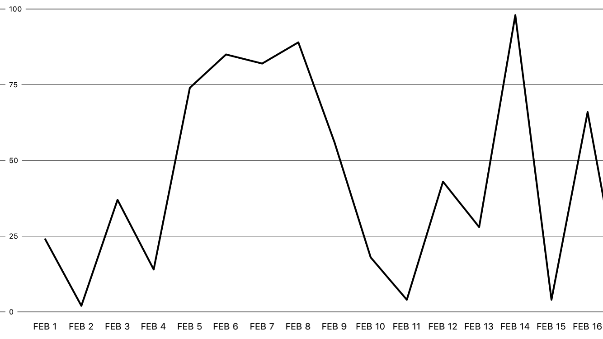

### Interface Builder support

There is now support for Interface Builder (from CocoaPod version 2.0.0). See the example project in the folder: [graphview_example_ib](graphview_example_ib/)

### Things you *could* use it for:

- ✔ Study applications to show time studied/etc
- ✔ Weather applications
- ✔ Prototyping
- ✔ *Simple* data visualisation

### Things you **shouldn't/cannot** use it for:

- ✘ Rigorous statistical software
- ✘ Important & complex data visualisation
- ✘ Graphing continuous mathematical functions

## Customisation

The entire graph is composed by initially creating an empty `ScrollableGraphView` object and progressively adding whatever plots and reference lines you require. 

Create a plot using the any of the `LinePlot`, `DotPlot`, `BarPlot` constructors. Create reference lines using the `ReferenceLines()` constructor. Before adding the `ScrollableGraphView` object to the view hierarchy, add the plots and reference lines to the graph using the `addPlot` and `addReferenceLines` methods. You can add multiple plots (examples are shown below). Each plot _must_ have the same number of data points.

In the case of interface builder, graph customisation is performed via the properties pane, whilst plots and reference lines customisation is done in the corresponding view controller. See the example project in the folder: [graphview_example_ib](graphview_example_ib/)

## Graph Customisation

These settings can be set directly on the `ScrollableGraphView` object before adding it to the view hierarchy.

#### Adapting & Animations
| Property                                                | Description                                                                                                                                                                                                                                                                                            |
|---------------------------------------------------------|--------------------------------------------------------------------------------------------------------------------------------------------------------------------------------------------------------------------------------------------------------------------------------------------------------|
| **shouldAdaptRange**: Bool                                  | Whether or not the y-axis' range should adapt to the points that are visible on screen. This means if there are only 5 points visible on screen at any given time, the maximum on the y-axis will be the maximum of those 5 points. This is updated automatically as the user scrolls along the graph. |
| **shouldAnimateOnAdapt**: Bool                              | If `shouldAdaptRange` is set to true then this specifies whether or not the points on the graph should animate to their new positions. Default is set to `true`. Looks very janky if set to `false`.                                                                                                         |
| **shouldAnimateOnStartup**: Bool                            | Whether or not the graph should animate to their positions when the graph is first displayed.                                                                                                                                                                                                          |

#### Spacing


| Property              | Description                                                                                                                                                                                                                                                                                                |
|-----------------------|------------------------------------------------------------------------------------------------------------------------------------------------------------------------------------------------------------------------------------------------------------------------------------------------------------|
| **topMargin**: CGFloat             | How far the "maximum" reference line is from the top of the view's frame. In points.                                                                                                                                                                                                                       |
| **bottomMargin**: CGFloat          | How far the "minimum" reference line is from the bottom of the view's frame. In points.                                                                                                                                                                                                                    |
| **leftmostPointPadding**: CGFloat  | How far the first point on the graph should be placed from the left hand side of the view.                                                                                                                                                                                                                 |
| **rightmostPointPadding**: CGFloat | How far the final point on the graph should be placed from the right hand side of the view.                                                                                                                                                                                                                |
| **dataPointSpacing**: CGFloat      | How much space should be between each data point.                                                                                                                                                                                                                                                          |
| **direction**: ScrollableGraphViewDirection             | Which way the user is expected to scroll from. Possible values: <ul><li>`ScrollableGraphViewDirection.leftToRight`</li><li>`ScrollableGraphViewDirection.rightToLeft`</li></ul>For example, if it is set to `.rightToLeft`, the graph will start on the "right hand side" of the graph and the user will have to scroll towards the left. |

#### Graph Range
| Property                       | Description                                                                                                                                                                                                |
|--------------------------------|------------------------------------------------------------------------------------------------------------------------------------------------------------------------------------------------------------|
| **rangeMin**: Double                       | The minimum value for the y-axis. This is ignored when `shouldAdaptRange` = `true`                                                                                           |
| **rangeMax**: Double                       | The maximum value for the y-axis. This is ignored when `shouldAdaptRange` = `true`                                                                                           |
| **shouldRangeAlwaysStartAtZero**: Bool   | Forces the graph's minimum to always be zero. Used in conjunction with `shouldAdaptRange`, if you want to force the minimum to stay at 0 rather than the detected minimum. |


## Plot Customisation


For all plots you can specify animation related information for when the plot first appears and during adaptions. All of th

#### Animation
| Property                                                | Description                                                                                                                                                                                                                                                                                            |
|---------------------------------------------------------|--------------------------------------------------------------------------------------------------------------------------------------------------------------------------------------------------------------------------------------------------------------------------------------------------------|
| **animationDuration**: Double                               | How long the animation should take. Affects both the startup animation and the animation when the range of the y-axis adapts to onscreen points.                                                                                                                                                       |
| **adaptAnimationType**: ScrollableGraphViewAnimationType    | The animation style. Possible values: <ul><li>`ScrollableGraphViewAnimationType.easeOut`</li><li>`ScrollableGraphViewAnimationType.elastic`</li><li>`ScrollableGraphViewAnimationType.custom`</li></ul>                                                                                                                                          |
| **customAnimationEasingFunction**: ((t: Double) -> Double)? | If `adaptAnimationType` is set to `.custom`, then this is the easing function you would like applied for the animation.                                                                                                                                                                                    |

### LinePlot

Line plot specific customisation options. These options are available on any `LinePlot` object.

#### Line Styles
| Property  | Description                                                                                                                                                                        |
|-----------|------------------------------------------------------------------------------------------------------------------------------------------------------------------------------------|
| **lineWidth**: CGFloat | Specifies how thick the graph of the line is. In points.                                                                                                                           |
| **lineColor**: UIColor | The color of the graph line. UIColor.                                                                                                                                              |
| **lineStyle**: ScrollableGraphViewLineStyle | Whether or not the line should be rendered using bezier curves are straight lines. Possible values: <ul><li>`ScrollableGraphViewLineStyle.straight`</li><li>`ScrollableGraphViewLineStyle.smooth`</li></ul> |
| **lineJoin**  | How each segment in the line should connect. Takes any of the Core Animation LineJoin values.                                                                                      |
| **lineCap**   | The line caps. Takes any of the Core Animation LineCap values.                                                                                                                     |

#### Fill Styles
| Property               | Description                                                                                                                                                                                                         |
|------------------------|---------------------------------------------------------------------------------------------------------------------------------------------------------------------------------------------------------------------|
| **shouldFill**: Bool             | Specifies whether or not the plotted graph should be filled with a colour or gradient.                                                                                                                              |
| **fillType**: ScrollableGraphViewFillType               | Specifies whether to fill the graph with a solid colour or gradient. Possible values: <ul><li>`ScrollableGraphViewFillType.solid`</li> <li>`ScrollableGraphViewFillType.gradient`</li></ul>                                                         |
| **fillColor**: UIColor              | If `fillType` is set to `.solid` then this colour will be used to fill the graph.                                                                                                                                       |
| **fillGradientStartColor**: UIColor | If `fillType` is set to `.gradient` then this will be the starting colour for the gradient.                                                                                                                             |
| **fillGradientEndColor**: UIColor   | If `fillType` is set to `.gradient`, then this will be the ending colour for the gradient.                                                                                                                              |
| **fillGradientType**:ScrollableGraphViewGradientType       | If `fillType` is set to `.gradient`, then this defines whether the gradient is rendered as a linear gradient or radial gradient. Possible values: <ul><li>`ScrollableGraphViewGradientType.linear`</li><li>`ScrollableGraphViewGradientType.radial`</li></ul> |

### DotPlot

Dot plot specific customisation options. These options are available on any `DotPlot` object.

| Property                                                  | Description                                                                                                                                                                                                                                                                 |
|-----------------------------------------------------------|-----------------------------------------------------------------------------------------------------------------------------------------------------------------------------------------------------------------------------------------------------------------------------|
| **dataPointType**: ScrollableGraphViewDataPointType           | The shape to draw for each data point. Possible values: <ul><li>`ScrollableGraphViewDataPointType.circle`</li><li>`ScrollableGraphViewDataPointType.square`</li><li>`ScrollableGraphViewDataPointType.custom`</li></ul>                                                                                               |
| **dataPointSize**: CGFloat                                    | The size of the shape to draw for each data point.                                                                                                                                                                                                                          |
| **dataPointFillColor**: UIColor                               | The colour with which to fill the shape.                                                                                                                                                                                                                                    |
| **customDataPointPath**: ((centre: CGPoint) -> UIBezierPath)? | If `dataPointType` is set to `.custom` then you,can provide a closure to create any kind of shape you would like to be displayed instead of just a circle or square. The closure takes a `CGPoint` which is the centre of the shape and it should return a complete `UIBezierPath`. |

### BarPlot

Bar plot specific customisation options. These options are available on any `BarPlot` object.

| Property                              | Description|
|---------------------------------------|------------|
| **barWidth**: CGFloat                 | The width of an individual bar on the graph.|
| **barColor**: UIColor                 | The actual colour of the bar.|
| **barLineWidth**: CGFloat             | The width of the outline of the bar.|
| **barLineColor**: UIColor             | The colour of the bar outline.|
| **shouldRoundBarCorners**: Bool       | Whether or not to use rounded corners for the bars.|


## Reference Line Customisation


These options are set on the `ReferenceLines` object before adding it to the graph view.

### Reference Lines

| Property                                                        | Description|
|-----------------------------------------------------------------|------------|
| **shouldShowReferenceLines**: Bool                                  | Whether or not to show the y-axis reference lines and labels.|
| **positionType**: ReferenceLinePositioningType         | Whether the reference lines should be placed relatively, (for example at 0%, 20%, 40%, 60%, 80% and 100% of the max y-axis value), or absolutely at specific values on the y-axis. Possible values: <ul><li>`ReferenceLinePositioningType.relative`</li><li>`ReferenceLinePositioningType.absolute`</li></ul>|
| **relativePositions**: [Double]                         | An array of positions where the reference lines should be placed. Used if `positionType == .relative`. For example, assigning a value of [0, 0.5, 1] will add 3 reference lines to the graph, one at the bottom of the y-axis (0%), one in the middle of the y-axis (50%) and one at the top (100%). All values in the array should be between 0 and 1. |
| **absolutePositions**: [Double]                         | An array of absolute positions where the reference lines should be placed. Used if `positionType == .absolute`. For example, assigning a value of [10, 35] will add 2 reference lines to the graph, one at the value of 10 on the y-axis, one at the value of 35 on the y-axis. |
| **includeMinMax**: Bool                         | Whether or not you want to render the minimum and maximum reference line. If this is true, the min and max reference lines are always rendered. Set this to false if you want to specify only one, or neither, with `relativePositions` or `absolutePositions`. |
| **referenceLineColor**: UIColor                                     | The colour for the reference lines.|
| **referenceLineThickness**: CGFloat                                 | The thickness of the reference lines.|
| **referenceLinePosition**: ScrollableGraphViewReferenceLinePosition | Where the labels should be displayed on the reference lines. Possible values: <ul><li>`ScrollableGraphViewReferenceLinePosition.left`</li><li>`ScrollableGraphViewReferenceLinePosition.right`</li><li>`ScrollableGraphViewReferenceLinePosition.both`</li></ul>|
| **shouldAddLabelsToIntermediateReferenceLines**: Bool               | Whether or not to add labels to the intermediate (between min and max) reference lines.|
| **shouldAddUnitsToIntermediateReferenceLineLabels**: Bool           | Whether or not to add units specified by the `referenceLineUnits` variable to the labels on the intermediate reference lines.|

### Reference Line Labels (y-axis)

| Property                                              | Description                                                                             |
|-------------------------------------------------------|-----------------------------------------------------------------------------------------|
| **referenceLineLabelFont**: UIFont                    | The font to be used for the reference line labels.                                      |
| **referenceLineLabelColor**: UIColor                  | The colour of the reference line labels.                                                |
| **shouldShowReferenceLineUnits**: Bool                | Whether or not to show the units on the reference lines.                                |
| **referenceLineUnits**: String?                       | The units that the y-axis is in. This string is used for labels on the reference lines. |
| **referenceLineNumberOfDecimalPlaces**: Int           | The number of decimal places that should be shown on the reference line labels.         |
| **referenceLineNumberStyle**: NSNumberFormatterStyle  | The number style that should be shown on the reference line labels.                     |

### Data Point Labels (x-axis)

| Property                                | Description                                                                         |
|-----------------------------------------|-------------------------------------------------------------------------------------|
| **shouldShowLabels**: Bool              | Whether or not to show the labels on the x-axis for each point.                     |
| **dataPointLabelTopMargin**: CGFloat    | How far from the "minimum" reference line the data point labels should be rendered. |
| **dataPointLabelBottomMargin**: CGFloat | How far from the bottom of the view the data point labels should be rendered.       |
| **dataPointLabelFont**: UIFont?         | The font for the data point labels.                                                 |
| **dataPointLabelColor**: UIColor        | The colour for the data point labels.                                               |
| **dataPointLabelsSparsity**: Int        | Used to force the graph to show every n-th dataPoint label                          |


## Customisation Examples

All of these examples can be seen in action in the example project: [graphview_example_code](graphview_example_code/) 

Open the project in Xcode and hit run.

_Note: Examples here use a "colorFromHex" extension for UIColor._

### Default
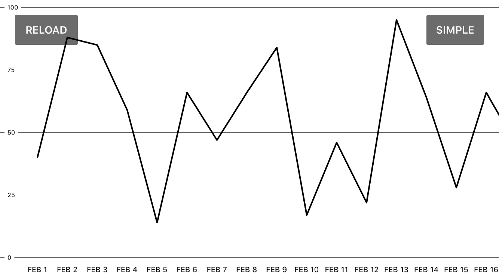
```swift
let graphView = ScrollableGraphView(frame: frame, dataSource: self)

let linePlot = LinePlot(identifier: "simple") // Identifier should be unique for each plot.
let referenceLines = ReferenceLines()

graphView.addPlot(plot: linePlot)
graphView.addReferenceLines(referenceLines: referenceLines)
```

### Bar Dark (Bar layer thanks to [@RedBlueThing](https://twitter.com/RedBlueThing))
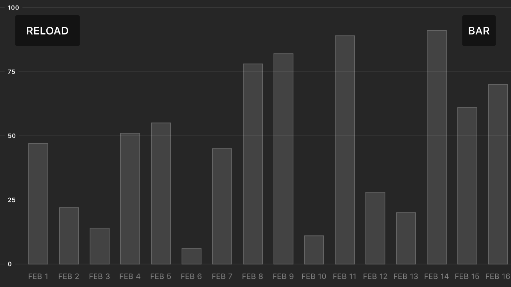
```swift
let graphView = ScrollableGraphView(frame: frame, dataSource: self)

// Setup the plot
let barPlot = BarPlot(identifier: "bar")

barPlot.barWidth = 25
barPlot.barLineWidth = 1
barPlot.barLineColor = UIColor.colorFromHex(hexString: "#777777")
barPlot.barColor = UIColor.colorFromHex(hexString: "#555555")

barPlot.adaptAnimationType = ScrollableGraphViewAnimationType.elastic
barPlot.animationDuration = 1.5

// Setup the reference lines
let referenceLines = ReferenceLines()

referenceLines.referenceLineLabelFont = UIFont.boldSystemFont(ofSize: 8)
referenceLines.referenceLineColor = UIColor.white.withAlphaComponent(0.2)
referenceLines.referenceLineLabelColor = UIColor.white

referenceLines.dataPointLabelColor = UIColor.white.withAlphaComponent(0.5)

// Setup the graph
graphView.backgroundFillColor = UIColor.colorFromHex(hexString: "#333333")

graphView.shouldAnimateOnStartup = true

graphView.rangeMax = 100
graphView.rangeMin = 0

// Add everything
graphView.addPlot(plot: barPlot)
graphView.addReferenceLines(referenceLines: referenceLines)
return graphView
```

### Smooth Dark
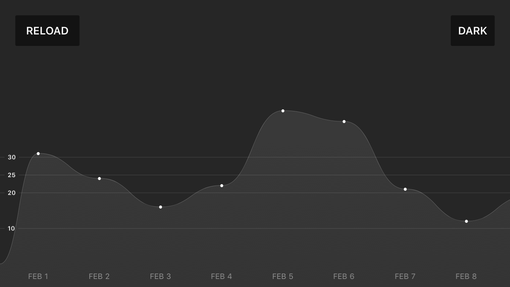
```swift
let graphView = ScrollableGraphView(frame: frame, dataSource: self)

// Setup the line plot.
let linePlot = LinePlot(identifier: "darkLine")

linePlot.lineWidth = 1
linePlot.lineColor = UIColor.colorFromHex(hexString: "#777777")
linePlot.lineStyle = ScrollableGraphViewLineStyle.smooth

linePlot.shouldFill = true
linePlot.fillType = ScrollableGraphViewFillType.gradient
linePlot.fillGradientType = ScrollableGraphViewGradientType.linear
linePlot.fillGradientStartColor = UIColor.colorFromHex(hexString: "#555555")
linePlot.fillGradientEndColor = UIColor.colorFromHex(hexString: "#444444")

linePlot.adaptAnimationType = ScrollableGraphViewAnimationType.elastic

let dotPlot = DotPlot(identifier: "darkLineDot") // Add dots as well.
dotPlot.dataPointSize = 2
dotPlot.dataPointFillColor = UIColor.white

dotPlot.adaptAnimationType = ScrollableGraphViewAnimationType.elastic

// Setup the reference lines.
let referenceLines = ReferenceLines()

referenceLines.referenceLineLabelFont = UIFont.boldSystemFont(ofSize: 8)
referenceLines.referenceLineColor = UIColor.white.withAlphaComponent(0.2)
referenceLines.referenceLineLabelColor = UIColor.white

referenceLines.positionType = .absolute
// Reference lines will be shown at these values on the y-axis.
referenceLines.absolutePositions = [10, 20, 25, 30]
referenceLines.includeMinMax = false

referenceLines.dataPointLabelColor = UIColor.white.withAlphaComponent(0.5)

// Setup the graph
graphView.backgroundFillColor = UIColor.colorFromHex(hexString: "#333333")
graphView.dataPointSpacing = 80

graphView.shouldAnimateOnStartup = true
graphView.shouldAdaptRange = true
graphView.shouldRangeAlwaysStartAtZero = true

graphView.rangeMax = 50

// Add everything to the graph.
graphView.addReferenceLines(referenceLines: referenceLines)
graphView.addPlot(plot: linePlot)
graphView.addPlot(plot: dotPlot)
```


### Dot
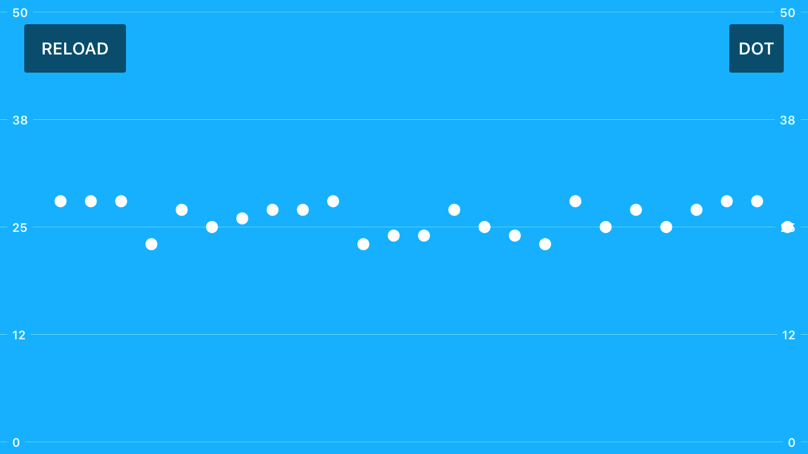
```swift
let graphView = ScrollableGraphView(frame: frame, dataSource: self)

// Setup the plot
let plot = DotPlot(identifier: "dot")

plot.dataPointSize = 5
plot.dataPointFillColor = UIColor.white

// Setup the reference lines
let referenceLines = ReferenceLines()
referenceLines.referenceLineLabelFont = UIFont.boldSystemFont(ofSize: 10)
referenceLines.referenceLineColor = UIColor.white.withAlphaComponent(0.5)
referenceLines.referenceLineLabelColor = UIColor.white
referenceLines.referenceLinePosition = ScrollableGraphViewReferenceLinePosition.both

referenceLines.shouldShowLabels = false

// Setup the graph
graphView.backgroundFillColor = UIColor.colorFromHex(hexString: "#00BFFF")
graphView.shouldAdaptRange = false
graphView.shouldAnimateOnAdapt = false
graphView.shouldAnimateOnStartup = false

graphView.dataPointSpacing = 25
graphView.rangeMax = 50
graphView.rangeMin = 0

// Add everything
graphView.addPlot(plot: plot)
graphView.addReferenceLines(referenceLines: referenceLines)
```

### Pink
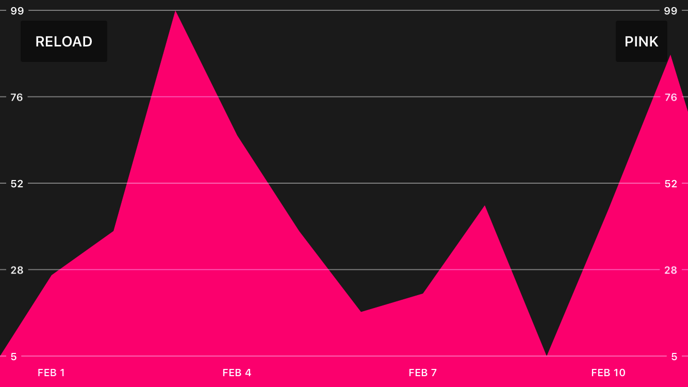
```swift
let graphView = ScrollableGraphView(frame: frame, dataSource: self)

// Setup the plot
let linePlot = LinePlot(identifier: "pinkLine")

linePlot.lineColor = UIColor.clear
linePlot.shouldFill = true
linePlot.fillColor = UIColor.colorFromHex(hexString: "#FF0080")

// Setup the reference lines
let referenceLines = ReferenceLines()

referenceLines.referenceLineThickness = 1
referenceLines.referenceLineLabelFont = UIFont.boldSystemFont(ofSize: 10)
referenceLines.referenceLineColor = UIColor.white.withAlphaComponent(0.5)
referenceLines.referenceLineLabelColor = UIColor.white
referenceLines.referenceLinePosition = ScrollableGraphViewReferenceLinePosition.both

referenceLines.dataPointLabelFont = UIFont.boldSystemFont(ofSize: 10)
referenceLines.dataPointLabelColor = UIColor.white
referenceLines.dataPointLabelsSparsity = 3

// Setup the graph
graphView.backgroundFillColor = UIColor.colorFromHex(hexString: "#222222")

graphView.dataPointSpacing = 60
graphView.shouldAdaptRange = true

// Add everything
graphView.addPlot(plot: linePlot)
graphView.addReferenceLines(referenceLines: referenceLines)
```

### Multiple Plots v1
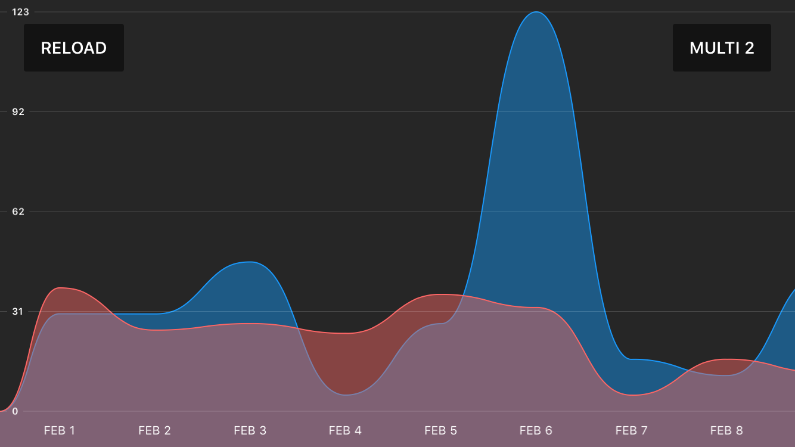
```swift
// Setup the line plot.
let blueLinePlot = LinePlot(identifier: "multiBlue")

blueLinePlot.lineWidth = 1
blueLinePlot.lineColor = UIColor.colorFromHex(hexString: "#16aafc")
blueLinePlot.lineStyle = ScrollableGraphViewLineStyle.smooth

blueLinePlot.shouldFill = true
blueLinePlot.fillType = ScrollableGraphViewFillType.solid
blueLinePlot.fillColor = UIColor.colorFromHex(hexString: "#16aafc").withAlphaComponent(0.5)

blueLinePlot.adaptAnimationType = ScrollableGraphViewAnimationType.elastic

// Setup the second line plot.
let orangeLinePlot = LinePlot(identifier: "multiOrange")

orangeLinePlot.lineWidth = 1
orangeLinePlot.lineColor = UIColor.colorFromHex(hexString: "#ff7d78")
orangeLinePlot.lineStyle = ScrollableGraphViewLineStyle.smooth

orangeLinePlot.shouldFill = true
orangeLinePlot.fillType = ScrollableGraphViewFillType.solid
orangeLinePlot.fillColor = UIColor.colorFromHex(hexString: "#ff7d78").withAlphaComponent(0.5)

orangeLinePlot.adaptAnimationType = ScrollableGraphViewAnimationType.elastic

// Setup the reference lines.
let referenceLines = ReferenceLines()

referenceLines.referenceLineLabelFont = UIFont.boldSystemFont(ofSize: 8)
referenceLines.referenceLineColor = UIColor.white.withAlphaComponent(0.2)
referenceLines.referenceLineLabelColor = UIColor.white

referenceLines.dataPointLabelColor = UIColor.white.withAlphaComponent(1)

// Setup the graph
graphView.backgroundFillColor = UIColor.colorFromHex(hexString: "#333333")

graphView.dataPointSpacing = 80
graphView.shouldAnimateOnStartup = true
graphView.shouldAdaptRange = true

graphView.shouldRangeAlwaysStartAtZero = true

// Add everything to the graph.
graphView.addReferenceLines(referenceLines: referenceLines)
graphView.addPlot(plot: blueLinePlot)
graphView.addPlot(plot: orangeLinePlot)
```

### Multiple Plots v2

It is possible to combine multiple plots to get different looks. We use the the dot plot to add markers to the line plot in this case:

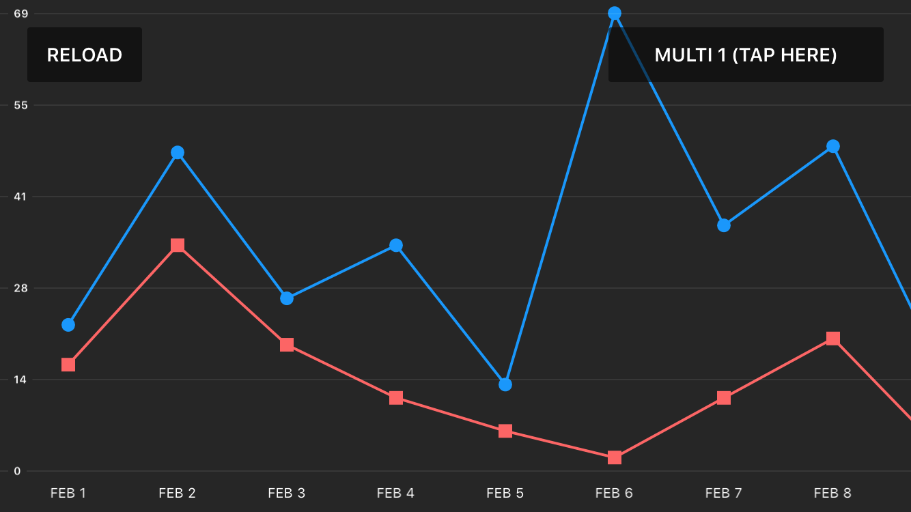

```swift
let graphView = ScrollableGraphView(frame: frame, dataSource: self)

// Setup the first plot.
let blueLinePlot = LinePlot(identifier: "multiBlue")

blueLinePlot.lineColor = UIColor.colorFromHex(hexString: "#16aafc")
blueLinePlot.adaptAnimationType = ScrollableGraphViewAnimationType.elastic

// dots on the line
let blueDotPlot = DotPlot(identifier: "multiBlueDot")
blueDotPlot.dataPointType = ScrollableGraphViewDataPointType.circle
blueDotPlot.dataPointSize = 5
blueDotPlot.dataPointFillColor = UIColor.colorFromHex(hexString: "#16aafc")

blueDotPlot.adaptAnimationType = ScrollableGraphViewAnimationType.elastic

// Setup the second plot.
let orangeLinePlot = LinePlot(identifier: "multiOrange")

orangeLinePlot.lineColor = UIColor.colorFromHex(hexString: "#ff7d78")
orangeLinePlot.adaptAnimationType = ScrollableGraphViewAnimationType.elastic

// squares on the line
let orangeSquarePlot = DotPlot(identifier: "multiOrangeSquare")
orangeSquarePlot.dataPointType = ScrollableGraphViewDataPointType.square
orangeSquarePlot.dataPointSize = 5
orangeSquarePlot.dataPointFillColor = UIColor.colorFromHex(hexString: "#ff7d78")

orangeSquarePlot.adaptAnimationType = ScrollableGraphViewAnimationType.elastic

// Setup the reference lines.
let referenceLines = ReferenceLines()

referenceLines.referenceLineLabelFont = UIFont.boldSystemFont(ofSize: 8)
referenceLines.referenceLineColor = UIColor.white.withAlphaComponent(0.2)
referenceLines.referenceLineLabelColor = UIColor.white
referenceLines.relativePositions = [0, 0.2, 0.4, 0.6, 0.8, 1]

referenceLines.dataPointLabelColor = UIColor.white.withAlphaComponent(1)

// Setup the graph
graphView.backgroundFillColor = UIColor.colorFromHex(hexString: "#333333")

graphView.dataPointSpacing = 80

graphView.shouldAnimateOnStartup = true
graphView.shouldAdaptRange = true
graphView.shouldRangeAlwaysStartAtZero = true

// Add everything to the graph.
graphView.addReferenceLines(referenceLines: referenceLines)
graphView.addPlot(plot: blueLinePlot)
graphView.addPlot(plot: blueDotPlot)
graphView.addPlot(plot: orangeLinePlot)
graphView.addPlot(plot: orangeSquarePlot)
```

## Known Issues

- Reloading the graph with a different number of data items is currently not supported.
- Performance in the simulator is not great.

If you find any bugs please create an issue on Github.

## Other

[Follow me on twitter](https://twitter.com/philackm) for interesting updates (read: gifs) about other things that I make.
